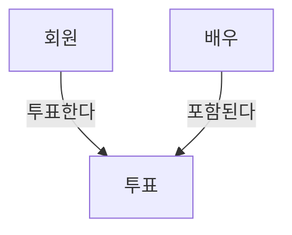

1) 모델링이란?
	1) 현실 세계를 단순화 하여 표기
	- ex) 투표

| ==회원== | ==투표==    | ==배우== |
| ------ | --------- | ------ |
|        |           |        |
| 이름     | 배우 번호(FK) | 이름     |
| 핸드폰번호  | 아이디(FK)   | 대표작    |
| 이메일주소  | 투표일시      |        |

2) 모델링의 특징
	1) 추상화
		- 일정하게 표현하는 것
	2) 단순화
		- 정해진 표현법으로 단순, 쉽게 표현
	3) 명확화
		- 불분명함 제거, 해석 용이
	- 한 마디로 현실세계를 추상화, 단순화, 명확화 하기 위해 일정한 표기법으로 표현하는 것

3) 모델링의 세가지 관점
	1) 데이터 관점
		1) 데이터를 위주로 모델링 하는 것 (어떤 업무와 얽힘, 관계가 있는지)
	2) 프로세스 관점
		1) 실제로 처리하고 있고, 해야할 일 모델링
	3) 데이터와 프로세스의 상관 관점
		1) 관계를 위주로 함. 
		2) 프로세스의 흐름에 따라서 데이터가 어떤 영향 받냐

- Tip 데이터의 품질 보장
	- 중복
		- 같은 데이터가 여러 엔터티에 중복 저장 막아야 함
	- 비유연성
		- 유지 보수의 원활성을 위해 데이터 모델과 프로세스 분리 할 것
	- 비일관성
		- 중복이 없어도 비일관성이 발생가능 한데, 연관성 고려 안 하고 일부 데이터만 변경할 수 있어서 그럼.
		- 연관관계 명확히 하자.

4) 모델링의 세 가지 과정
	1) 개념적 데이터 모델링
		- 전사(전체 회사)적 단계 추상화 단계 가장 높음
		- 업무 중심적, 포괄적 수준의 모델링
	2) 논리적 데이터 모델링
		- 재사용성 가장 높은 모델링
		- key, 속성, 관계 모두 표현하는 것
	3) 물리적 데이터 모델링
		- 성능, 가용성등의 물리적 성격 고려

5) 데이터의 독립성
	- [[ANSI-SPARC]](images/ANSI-SPARC.md)

6) [[ERD]](images/ERD.md)
	- 시스템에 어떤 엔터티들이 존재, 그들의 관게를 나타내는 다이어그램
	- 

